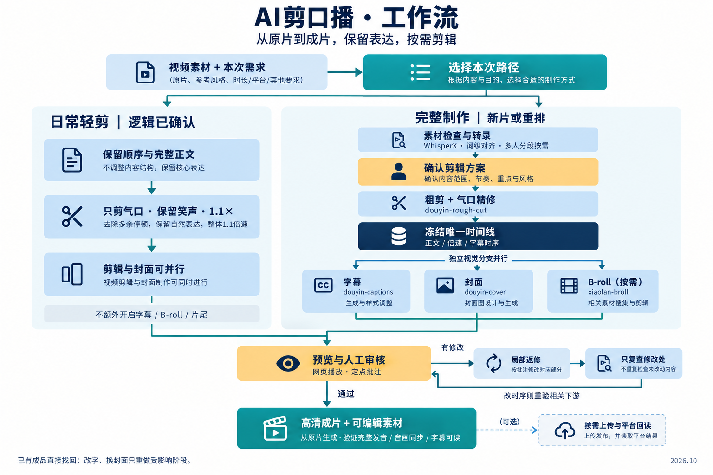

# AI剪口播

从原片到成片的口播剪辑工作流：按本次需求选择路径，在网页中审核，局部返修后交付高清成片。



## 选择本次路径

| 需求 | 执行方式 |
| --- | --- |
| 日常轻剪，逻辑已确认 | 保留原顺序、完整正文和笑声，只剪气口；日常音画同步 1.1×，封面可并行制作。已有字幕保留，不额外开启字幕、B-roll 或片尾。 |
| 新片、多段素材或需要重排 | 素材初检与 WhisperX 转录 → 确认剪辑方案 → 粗剪/气口精修 → 冻结唯一时间线 → 字幕、封面和已启用的 B-roll 并行 → 网页审核 → 高清交付。 |
| 改字、挪字幕、换封面 | 复用已确认时间线、音轨和资产，只重做受影响阶段；时序变化时重新验证相关下游。 |
| 找回已剪成品 | 定位最新已验收文件，直接交付，不重新转录或渲染。 |

## 审核与交付

网页支持播放和定点批注。返修先处理修改片段，修改后旧通过状态失效；需要逐块审核的任务在全部通过后才生成完整 Preview。最终高清从原片生成，不放大低清预览。

输出可包含高清 MP4、字幕与时间线等可编辑素材；剪映草稿只有实际生成并重开验收后才算交付。上传属于按需调用的独立阶段，成片生成、平台草稿和公开发布分别确认。

## 安装与依赖

将本目录放到 coding agent 的 skills 目录，入口为 [SKILL.md](SKILL.md)。本目录是 Peter 当前版本的发布副本，保留了原有脚本与规则；详细参数和分支优先级以 SKILL.md 为准。

基础工具：Node.js、Python 3、FFmpeg/ffprobe。新转录使用本地 WhisperX，词级对齐和多人说话人分段按需配置。旧火山引擎脚本保留用于兼容，凭证在本机配置，真实 `.env` 不随仓库发布。

此 skill 是总控，并非一个目录即可运行全部能力。按启用路径安装配套 skill：

- `douyin-rough-cut`、`clip-fine-cut-rhythm`：粗剪、气口、时间线与同步。
- `douyin-captions`、`douyin-cover`、`xiaolan-broll`：字幕、封面和按需视觉包装。
- `video-quick-revision`：局部返修；`social-auto-upload`：按需上传与平台回读。
- `startlux-decision`：当前规则中的分类与候选选择节点；另需配置其本地服务。

本次仅发布 AI剪口播 目录；其他依赖需要另行安装。规则中仍包含 Peter 的本地路径、既有偏好及工具入口，迁移机器时需要配置。此次发布验证了指定脚本测试和文件完整性，未在全新机器执行端到端视频剪辑。

## 可直接使用的指令

```text
用 AI剪口播处理这段视频。逻辑已经确认，按日常轻剪：
保留顺序和完整正文，只剪气口，保留笑声，音画同步 1.1×，
输出 9:16 竖版；已有字幕保留，封面可并行制作。
不要额外开启 B-roll 或片尾，先复用已有工程和有效验收。
```

## 来源与许可

由 **栗氪聊AI** 创建，原项目：[lcbuaaliu/ai-jian-koubo](https://github.com/lcbuaaliu/ai-jian-koubo)。本目录包含 Peter 的工作流扩展。

保留 [AGPL-3.0](LICENSE) 许可与原作者署名。
