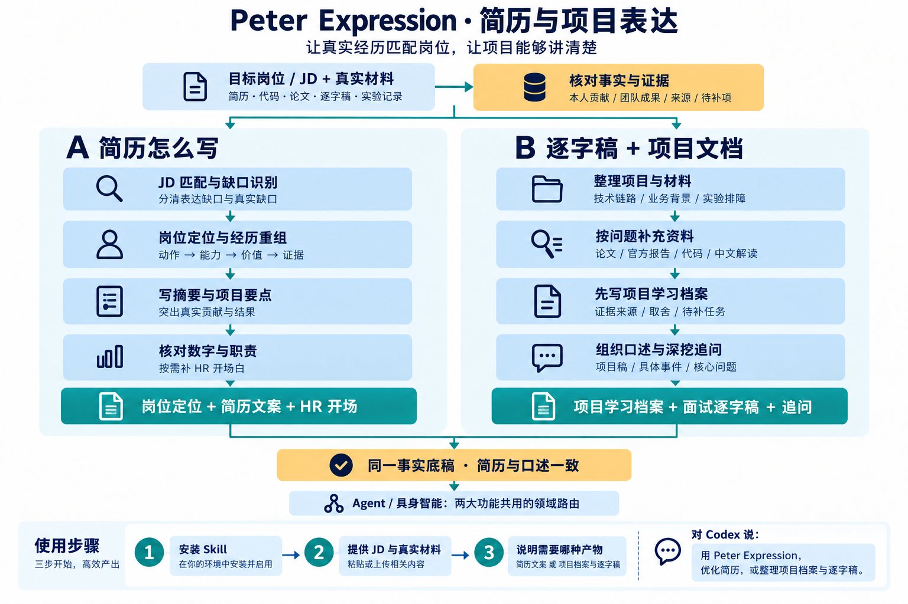

# Peter Expression｜简历写作与项目表达

把真实材料整理成两类能直接使用的求职产物：**A 简历怎么写**，以及 **B 逐字稿＋项目文档**。融合 [ASu-skills](https://github.com/Hisn00w/ASu-skills) 的岗位定位、JD 匹配和经历重组方法，保留 Peter 的 C/E/S、L1–L5 与 GAN 式追问。



## 两大功能

| 功能 | 提供什么材料 | 可以得到什么 |
|---|---|---|
| A 简历怎么写 | 目标 JD/岗位方向、原简历、真实项目与职责证据 | 岗位定位、顶部摘要、项目/经历 bullet、强主张核对；按需 HR 开场白与补证清单 |
| B 逐字稿＋项目文档 | 项目说明、代码、论文、实验/日志、课堂原稿或 A 的事实底稿 | 项目学习档案、可口述项目面试逐字稿、事件深挖、核心追问与待补证据 |

**共享底座**：同一份主张—证据账本与 C（主张）/E（本人证据）/S（外部来源）；`agent`、`embodied` 或明确跨域的 `mixed` 是领域维度，不是两大功能。只要一项就只生成一项；同时需要时保证数字、职责与版本一致。

## 怎么使用

将本目录复制到 `~/.codex/skills/peter-ai-interview-expression`，或把此 GitHub 目录交给你的 Coding Agent 安装。新建会话后调用：

```text
使用 peter-ai-interview-expression 帮我写简历。
这是目标 JD 和原简历：……
请给岗位定位、顶部摘要和 3 条项目 bullet，区分个人贡献与团队成果。
```

```text
使用 peter-ai-interview-expression，以具身智能为重点，
把这些代码、课堂逐字稿和真实实验记录整理成项目学习档案与项目面试逐字稿，
标出未核实的指标与待补证据。
```

```text
使用 peter-ai-interview-expression，先按 JD 优化简历，
再用同一份事实底稿生成项目学习档案和 90 秒左右的口述稿。
```

## Modules / Features

- **岗位匹配与经历重组**：分开已匹配、表达缺口、证据不足、真实缺口与待确认，按真实动作/能力/价值/结果/个人边界重写。
- **主张—证据账本**：附虚构示例模板，简历与口述稿共用事实；用户自述、材料支持与亲自验证分别记录。
- **项目学习档案**：技术链路、业务背景、取舍、实验排障、来源与下一步补证。
- **面试逐字稿与追问**：30–40 秒开场、约 90 秒展开、有证据的事件与最多五个核心追问；时长为估计。
- **领域与资料路由**：Agent / 具身智能资料分开；内置中美四组各 30 的来源席位历史快照，按具体问题少量选源，不等于所有正文已读或实时验证。

随包实际脚本是只读来源筛选器，例如：

```bash
python3 scripts/select_official_sources.py --domain embodied --company 'Physical Intelligence'
python3 scripts/select_official_sources.py --domain agent --company LangChain
python3 scripts/select_official_sources.py --kind materials --domain agent --company 美团
python3 scripts/select_official_sources.py --kind materials --domain embodied --query 数据 --limit 3
```

来源快照更新到 **2026-10-05**，新增6条已归档技术材料（5条旧文补录、1条发布日期待核），保留已读范围和局限，不代表6条新发布或120家正文全部读完。用 `--kind materials` 直接查具体材料；默认公司入口查询保持兼容。

[项目研究深化](references/project-research-playbook.md) 补充 Agent 任务验收、VLA 动作队列与控制权、复现排障，以及需求/责任/资源/验收/交接证据；这些是研究方法与历史案例，不自动变成本人经历。

本包交付 Markdown/文本内容与档案，未包含 ASu 的 HTML/PDF 简历编辑器、网页投递或邮件跟踪。若已有相应工具，可在用户明确需要时交接。

## 来源与许可

本次 ASu 融合固定核读 commit `cb9f3080897c24305b2a888d6c363367aed53563`；模板原样保留，其余方法适配到 A/B 流程。见 [THIRD_PARTY_NOTICES.md](THIRD_PARTY_NOTICES.md) 和 [ASu MIT 全文](licenses/ASu-skills-MIT.txt)。未复制其他私有 skill 或用户材料。

核心入口：[SKILL.md](SKILL.md) · 简历流程：[resume-workflow.md](references/resume-workflow.md) · 项目流程：[project-dossier-workflow.md](references/project-dossier-workflow.md)
