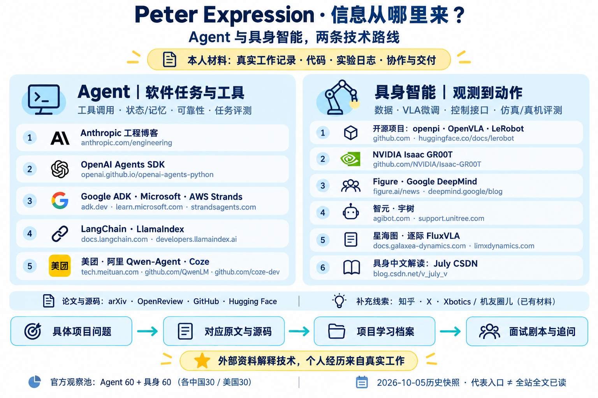

# Peter Expression｜信息源网站地图

> 源于真实工作，高于真实工作。个人经历来自本人工作材料；外部网站用于解释机制、对照方案与排查问题。

## 目录

- [先区分两类材料](#先区分两类材料)
- [Agent：软件任务、工具与评测](#agent软件任务工具与评测)
- [具身智能：数据、VLA、控制与部署](#具身智能数据vla控制与部署)
- [论文、源码与解释渠道](#论文源码与解释渠道)
- [完整官方观察池：Agent 60＋具身 60](#完整官方观察池agent-60具身-60)
- [怎样进入项目档案与面试剧本](#怎样进入项目档案与面试剧本)



## 先区分两类材料

- **本人材料 / E**：真实工作记录、代码与提交、实验日志、协作与交付记录、明确标记的本人自述。它们回答“我做过什么”。
- **外部资料 / S**：下面列出的网站、报告、源码与讨论。它们回答“机制是什么、为什么这样设计、可怎样验证”；不能自动变成本人经历。

官方公司观察池采用 **2026-10-05 历史快照**：Agent 中国30/美国30；具身中国30/美国30，共120领域席位。跨领域公司可重复，但同一领域不凑数；不是严格Top排名或120个不同网站。本轮整理可读入口与配图，不宣称120家公司全站文章已读。原索引的日期、读取状态、失败记录及局限保持不变。

## Agent：软件任务、工具与评测

围绕输入、工具调用、状态/记忆、重试与幂等、任务验收、成本和上线评测选择资料。

| 名称 | 具体网站 / 入口 | 主要查什么 |
|---|---|---|
| Anthropic | [工程博客](https://www.anthropic.com/engineering) · [Claude Agent SDK](https://code.claude.com/docs/en/agent-sdk/overview) | Agent工程、执行环境、SDK与评测 |
| OpenAI | [Agents SDK](https://openai.github.io/openai-agents-python/) · [官方仓库](https://github.com/openai/openai-agents-python) | 工具编排、运行时、追踪和SDK实现 |
| Google | [ADK](https://adk.dev/) · [官方仓库](https://github.com/google/adk-python) | Agent框架、工具与运行机制 |
| Microsoft | [Agent Framework](https://learn.microsoft.com/en-us/agent-framework/overview/) | Agent框架与集成文档 |
| Amazon / AWS | [Strands](https://strandsagents.com/) · [AWS工程博客](https://aws.amazon.com/blogs/) | 工具与工作流、决策、重试和业务取舍 |
| LangChain | [LangGraph文档](https://docs.langchain.com/oss/python/langgraph/overview) | 状态、图工作流、持久化与运行时 |
| LlamaIndex | [Agent文档](https://developers.llamaindex.ai/python/framework/module_guides/deploying/agents/) | 数据/检索与Agent组件 |
| 美团 / LongCat | [美团技术博客](https://tech.meituan.com/) · [LongCat官方仓库](https://github.com/meituan-longcat/LongCat-Flash-Chat) | 业务工程、Trace、任务评测与回归 |
| 阿里 / Qwen-Agent | [Qwen-Agent](https://github.com/QwenLM/Qwen-Agent) · [阿里云文档](https://help.aliyun.com/zh/model-studio/qwen-function-calling) | 工具调用与框架实现 |
| 字节 / Coze | [Coze Studio](https://github.com/coze-dev/coze-studio) | Agent平台与工程代码 |

这里列代表入口；完整60席位见后文和机器可读索引。返回入口不等于读过正文或复现过效果。

## 具身智能：数据、VLA、控制与部署

围绕图像/状态/语言到动作的闭环，按模型、本体和版本查数据格式、微调、评估、动作语义与控制接口。

| 名称 | 具体网站 / 入口 | 主要查什么 |
|---|---|---|
| Physical Intelligence / openpi | [openpi官方仓库](https://github.com/Physical-Intelligence/openpi) · [PI博客](https://www.pi.website/blog) | VLA模型、数据、训练、策略服务；博客历史访问失败状态保留 |
| NVIDIA / GR00T | [Isaac-GR00T](https://github.com/NVIDIA/Isaac-GR00T) · [机器人技术博客](https://developer.nvidia.com/blog/category/robotics/) | 微调、数据适配、模型与机器人开发 |
| Figure | [Figure研究/技术文章](https://www.figure.ai/news) | 数据、操作模型与系统机制；公司自报指标不当独立评测 |
| Google DeepMind | [官方博客](https://deepmind.google/blog/) | Gemini Robotics等机器人研究与报告 |
| 智元 AgiBot | [研究页](https://agibot.com/research/) · [官方GitHub](https://github.com/AgibotTech) | 具身研究、开源数据与实现 |
| 宇树 Unitree | [开发文档](https://support.unitree.com/home/zh/developer) · [官方GitHub](https://github.com/unitreerobotics) | SDK、通信、机器人接口；SDK不等于VLA基础模型 |
| 星海图 Galaxea | [开发文档](https://docs.galaxea-dynamics.com/home/) · [官方用户指南](https://github.com/userguide-galaxea) | 本体、平台、接口与部署 |
| 逐际 LimX / FluxVLA | [FluxVLA](https://www.limxdynamics.com/zh/products/fluxvla) · [官方仓库](https://github.com/FluxVLA/FluxVLA) | 数据契约、训练/部署、评测边界 |

**补充开源项目，不计入公司60席位：** [OpenVLA](https://github.com/openvla/openvla)、[LeRobot文档](https://huggingface.co/docs/lerobot) / [源码](https://github.com/huggingface/lerobot)。它们提供对应模型、数据、训练和执行实现，不能混用模型/框架版本。

## 论文、源码与解释渠道

| 渠道 | 网站 | 用途和读取边界 |
|---|---|---|
| 原论文与报告 | [arXiv](https://arxiv.org/) · [OpenReview](https://openreview.net/)；Agent已有[ACL ToolSandbox引用](https://aclanthology.org/2025.findings-naacl.65/) | 查方法、设置、消融和局限；摘要、正文、评审分别记录，不宣称具身ACL材料已读 |
| 实现与复现问题 | [GitHub](https://github.com/) · [Hugging Face](https://huggingface.co/) / [论坛](https://discuss.huggingface.co/) | 固定commit/tag/revision，看源码、模型/数据卡、Issue/PR；帖子不等于已修复 |
| 中文解释 | [July CSDN](https://blog.csdn.net/v_july_v) · [知乎](https://www.zhihu.com/) | July当前具体入口集中在具身/VLA；中文解释追原文与代码，是否已读按具体文章判断 |
| 新材料发现与作者澄清 | [X](https://x.com/)及作者主页 | 寻找报告、更新和讨论，再回一手材料；短帖不替代实验 |
| 已提供的社区材料 | Xbotics、机友圈儿 | 有可读材料时补论文导航、排障或客户/协作语境；无固定核实URL就不造链接，不假定访问或答疑服务 |
| 非技术项目方法 | [NASA](https://www.nasa.gov/reference/6-0-crosscutting-technical-management/) · [PMI](https://www.pmi.org/learning/library/mastering-project-requirements-planning-controlling-closing-5814) · [ASQ 8D](https://asq.org/quality-resources/eight-disciplines-8d) · [Google SRE](https://sre.google/workbook/postmortem-culture/) | 需求/接口/资源/验收/复盘的思路；方法框架不证明本人完成了相关工作 |

## 完整官方观察池：Agent 60＋具身 60

以下逐行来自 `official-company-sources.json`，按领域和国别显示所有120席位的原入口。空文档/源码栏保持“—”；历史读取状态不变，不把当前网页可访问当作历史结论已重新验证。

### Agent｜中国30席位

| 公司 / 来源ID | 工程/研究入口 | 文档 | 源码 | 补充入口 / 历史状态 |
|---|---|---|---|---|
| 阿里巴巴 / 阿里云<br/>`agent-cn-alibaba` | [入口](https://github.com/QwenLM/Qwen-Agent) | [文档](https://help.aliyun.com/zh/model-studio/qwen-function-calling) | [GitHub](https://github.com/QwenLM/Qwen-Agent) | 正文与代码抽查 |
| 腾讯<br/>`agent-cn-tencent` | [入口](https://github.com/Tencent/WeKnora) | — | [GitHub](https://github.com/Tencent/WeKnora) | README正文抽查；外链文档访问失败 |
| 百度<br/>`agent-cn-baidu` | [入口](https://ai.baidu.com/ai-doc/index/AppBuilder) | [文档](https://ai.baidu.com/ai-doc/index/AppBuilder) | [GitHub](https://github.com/baidubce/app-builder) | 目录与SDK README核对；最佳实践正文待深读 |
| 字节跳动 / 扣子<br/>`agent-cn-bytedance` | [入口](https://github.com/coze-dev/coze-studio) | [文档](https://github.com/coze-dev/coze-studio#developer-guide) | [GitHub](https://github.com/coze-dev/coze-studio) | README正文抽查；独立文档站访问失败 |
| 华为云<br/>`agent-cn-huawei` | [入口](https://support.huaweicloud.com/agentarts/index.html) | [文档](https://support.huaweicloud.com/agentarts/index.html) | — | 技术指南正文抽查 |
| 智谱 / Z.ai<br/>`agent-cn-zhipu` | [入口](https://github.com/zai-org/Open-AutoGLM) | [文档](https://github.com/zai-org/Open-AutoGLM#项目介绍) | [GitHub](https://github.com/zai-org/Open-AutoGLM) | README正文抽查；独立API文档访问失败 |
| MiniMax<br/>`agent-cn-minimax` | [入口](https://www.minimax.io/news) | [文档](https://platform.minimax.io/docs/guides/text-m3-function-call) | [GitHub](https://github.com/MiniMax-AI/MiniMax-M1) | 技术指南正文抽查 |
| 月之暗面 / Moonshot AI<br/>`agent-cn-moonshot` | [入口](https://github.com/MoonshotAI/Kimi-K2) | — | [GitHub](https://github.com/MoonshotAI/Kimi-K2) | README正文抽查；技术博客仅确认入口 |
| DeepSeek<br/>`agent-cn-deepseek` | [入口](https://api-docs.deepseek.com/) | [文档](https://api-docs.deepseek.com/guides/tool_calls/) | [GitHub](https://github.com/deepseek-ai/DeepSeek-V3) | 技术指南正文抽查（直接HTTP）；web读取超时 |
| 京东<br/>`agent-cn-jd` | [入口](https://github.com/jd-opensource/joyagent-jdgenie) | [文档](https://github.com/jd-opensource/joyagent-jdgenie/blob/main/Deploy.md) | [GitHub](https://github.com/jd-opensource/joyagent-jdgenie) | README正文抽查；部署指南打开 |
| 蚂蚁集团<br/>`agent-cn-antgroup` | [入口](https://github.com/agentuniverse-ai/agentUniverse) | — | [GitHub](https://github.com/agentuniverse-ai/agentUniverse) | README正文抽查；组织迁移已记录 |
| 阶跃星辰 StepFun<br/>`agent-cn-stepfun` | [入口](https://github.com/stepfun-ai/gelab-zero) | — | [GitHub](https://github.com/stepfun-ai/gelab-zero) | README正文抽查 |
| 百川智能<br/>`agent-cn-baichuan` | [入口](https://github.com/baichuan-inc/Baichuan2) | — | [GitHub](https://github.com/baichuan-inc/Baichuan2) | README正文抽查；官网正文为空 |
| 零一万物 01.AI<br/>`agent-cn-01ai` | [入口](https://www.01.ai/cn1) | — | [GitHub](https://github.com/01-ai/Yi) | 公司页与Yi README抽查 |
| 商汤 SenseTime<br/>`agent-cn-sensetime` | [入口](https://github.com/OpenSenseNova) | — | [GitHub](https://github.com/OpenSenseNova) | 组织页已读；官网搜索缓存；API文档读取失败 |
| 科大讯飞<br/>`agent-cn-iflytek` | [入口](https://www.xfyun.cn/doc/spark/workflow.html) | — | — | API和开发指南正文抽查 |
| 昆仑万维 / 天工 Skywork<br/>`agent-cn-kunlun` | [入口](https://www.tiangong.cn/help) | — | [GitHub](https://github.com/SkyworkAI/DeepResearchAgent) | 帮助中心与DeepResearchAgent README抽查 |
| 360集团 / 纳米AI<br/>`agent-cn-360` | [入口](https://factory.360.cn/) | — | — | 产品页仅搜索缓存；实时超时；许可协议正文已读 |
| 小米 / MiMo<br/>`agent-cn-xiaomi` | [入口](https://github.com/XiaomiMiMo/MiMo-V2-Flash) | — | [GitHub](https://github.com/XiaomiMiMo/MiMo-V2-Flash) | [补充入口](https://mimo.xiaomi.com/)：官方README直接链接；博客正文本轮未读；README正文抽查 |
| 美团 / LongCat<br/>`agent-cn-meituan` | [入口](https://github.com/meituan-longcat/LongCat-Flash-Chat) | — | [GitHub](https://github.com/meituan-longcat/LongCat-Flash-Chat) | [补充入口](https://tech.meituan.com/)：实时读取失败，后续重试；README正文抽查；技术博客本轮读取失败 |
| 快手 / Kwaipilot<br/>`agent-cn-kuaishou` | [入口](https://github.com/Kwaipilot) | — | [GitHub](https://github.com/Kwaipilot) | 组织归属与arXiv摘要已读 |
| 网易 / 有道<br/>`agent-cn-netease` | [入口](https://github.com/netease-youdao/QAnything) | — | [GitHub](https://github.com/netease-youdao/QAnything) | README正文抽查 |
| 面壁智能 ModelBest<br/>`agent-cn-modelbest` | [入口](https://www.modelbest.cn/en) | [文档](https://minicpmo45.modelbest.cn/docs/zh/) | [GitHub](https://github.com/OpenBMB/MiniCPM) | 公司页与MiniCPM README抽查 |
| 金山办公 / WPS<br/>`agent-cn-kingsoft` | [入口](https://open.wps.cn/documents/app-integration-dev/mcp-server/introduction) | — | — | 文档正文已读 |
| 第四范式<br/>`agent-cn-4paradigm` | [入口](https://www.4paradigm.com/about/research.html) | — | — | 研究目录正文已读；SageGPT产品页仅缓存、实时失败 |
| 澜舟科技 Langboat<br/>`agent-cn-langboat` | [入口](https://www.langboat.com/en) | — | [GitHub](https://github.com/Langboat/Mengzi3) | 官网与Mengzi3 README抽查 |
| 来也科技 Laiye<br/>`agent-cn-laiye` | [入口](https://laiye.com/en) | [文档](https://documents.laiye.com/rpa-creator-cn/docs/) | — | 平台与UiBot说明正文抽查 |
| 影刀<br/>`agent-cn-yingdao` | [入口](https://www.yingdao.com/yddoc/ap/zh-CN/808299717297909760) | — | — | 官方搜索缓存读到技能摘要；实时页面0行 |
| 携程集团 / Trip.com<br/>`agent-cn-trip` | [入口](https://www.trip.com/newsroom/introducing-tripgenie-groundbreaking-ai-travel-assistant/) | — | — | 发布正文已读 |
| 实在智能<br/>`agent-cn-indeed` | [入口](https://www.ai-indeed.com/news/technology) | — | — | 栏目正文与版权归属已读 |

### Agent｜美国30席位

| 公司 / 来源ID | 工程/研究入口 | 文档 | 源码 | 补充入口 / 历史状态 |
|---|---|---|---|---|
| OpenAI<br/>`agent-us-openai` | [入口](https://openai.com/research/index/) | [文档](https://openai.github.io/openai-agents-python/) | [GitHub](https://github.com/openai/openai-agents-python) | [Blog \| OpenAI Developers](https://developers.openai.com/blog)：目录正文已读；代表博客正文抽查；SDK与研究目录核对 |
| Anthropic<br/>`agent-us-anthropic` | [入口](https://www.anthropic.com/engineering) | [文档](https://code.claude.com/docs/en/agent-sdk/overview) | [GitHub](https://github.com/anthropics/claude-agent-sdk-python) | 代表博客正文抽查；目录与SDK核对 |
| Google<br/>`agent-us-google` | [入口](https://developers.googleblog.com/) | [文档](https://adk.dev/) | [GitHub](https://github.com/google/adk-python) | 代表博客正文抽查；目录与代码入口核对 |
| Microsoft<br/>`agent-us-microsoft` | [入口](https://learn.microsoft.com/en-us/agent-framework/overview/) | [文档](https://learn.microsoft.com/en-us/agent-framework/overview/) | [GitHub](https://github.com/microsoft/agent-framework) | 技术文档正文抽查 |
| Amazon / AWS<br/>`agent-us-amazon` | [入口](https://aws.amazon.com/blogs/?nc2=h_dsc_blg) | [文档](https://strandsagents.com/) | [GitHub](https://github.com/strands-agents/harness-sdk) | 代表博客正文抽查；目录和仓库核对 |
| Meta<br/>`agent-us-meta` | [入口](https://engineering.fb.com/) | — | [GitHub](https://github.com/meta-llama/llama-models) | 代表文章正文抽查；工程目录核对 |
| Salesforce<br/>`agent-us-salesforce` | [入口](https://developer.salesforce.com/developer-centers/agentforce) | [文档](https://developer.salesforce.com/docs/ai/agentforce/guide) | [GitHub](https://github.com/trailheadapps/coral-cloud) | 文档正文抽查；目录与样例README核对 |
| ServiceNow<br/>`agent-us-servicenow` | [入口](https://www.servicenow.com/research/) | [文档](https://github.com/ServiceNow/AgentLab) | [GitHub](https://github.com/ServiceNow/AgentLab) | README正文抽查；研究目录核对 |
| Databricks<br/>`agent-us-databricks` | [入口](https://docs.databricks.com/aws/en/agents/custom-agents/build-agents) | [文档](https://docs.databricks.com/aws/en/agents/custom-agents/build-agents) | [GitHub](https://github.com/databricks/genai-cookbook) | 技术文档正文抽查；仓库入口核对 |
| DoorDash<br/>`agent-us-doordash` | [入口](https://careersatdoordash.com/engineering-blog/) | — | — | 代表工程正文抽查；目录核对 |
| NVIDIA<br/>`agent-us-nvidia` | [入口](https://docs.nvidia.com/nemo/) | [文档](https://docs.nvidia.com/nemo/agent-toolkit/latest/) | [GitHub](https://github.com/NVIDIA/NeMo-Agent-Toolkit) | verified_technical_text |
| IBM<br/>`agent-us-ibm` | [入口](https://developer.watson-orchestrate.ibm.com/) | [文档](https://developer.watson-orchestrate.ibm.com/) | — | verified_technical_text |
| Oracle<br/>`agent-us-oracle` | [入口](https://docs.oracle.com/en/cloud/saas/fusion-ai/) | [文档](https://docs.oracle.com/en/cloud/saas/fusion-ai/) | — | verified_technical_text |
| Adobe<br/>`agent-us-adobe` | [入口](https://experienceleague.adobe.com/en/docs/cx-enterprise-ai/experience-cloud-ai/home) | [文档](https://experienceleague.adobe.com/en/docs/cx-enterprise-ai/experience-cloud-ai/home) | — | verified_technical_text |
| Snowflake<br/>`agent-us-snowflake` | [入口](https://docs.snowflake.com/en/user-guide/snowflake-cortex/cortex-agents) | [文档](https://docs.snowflake.com/en/user-guide/snowflake-cortex/cortex-agents) | — | verified_technical_text |
| Palantir<br/>`agent-us-palantir` | [入口](https://www.palantir.com/docs/foundry/aip/overview/) | [文档](https://www.palantir.com/docs/foundry/) | — | verified_technical_text |
| Intuit<br/>`agent-us-intuit` | [入口](https://www.intuit.com/technology/) | [文档](https://quickbooks.intuit.com/learn-support/en-us/quickbooks-online/intuit-platform/) | — | verified_official_architecture_overview |
| UiPath<br/>`agent-us-uipath` | [入口](https://docs.uipath.com/agents/automation-cloud/latest/user-guide/about-agents) | [文档](https://docs.uipath.com/agents/automation-cloud/latest/user-guide/about-agents) | — | verified_technical_text |
| Workday<br/>`agent-us-workday` | [入口](https://doc.workday.com/admin-guide/en-us/workday-ai/agents/setup-considerations--agent-system-of-record.html) | [文档](https://doc.workday.com/admin-guide/en-us/workday-ai/agents/setup-considerations--agent-system-of-record.html) | — | verified_technical_text |
| HubSpot<br/>`agent-us-hubspot` | [入口](https://knowledge.hubspot.com/customer-agent/set-up-the-customer-agent) | [文档](https://knowledge.hubspot.com/customer-agent/set-up-the-customer-agent) | — | verified_technical_text |
| Zoom<br/>`agent-us-zoom` | [入口](https://developers.zoom.us/docs/mcp/) | [文档](https://developers.zoom.us/docs/mcp/) | — | verified_technical_text |
| MongoDB<br/>`agent-us-mongodb` | [入口](https://www.mongodb.com/docs/vector-search/about/ai-agents/) | [文档](https://www.mongodb.com/docs/vector-search/) | — | verified_technical_text |
| Cognition<br/>`agent-us-cognition` | [入口](https://docs.devin.ai/) | [文档](https://docs.devin.ai/) | — | verified_technical_text |
| Glean<br/>`agent-us-glean` | [入口](https://docs.glean.com/agents) | [文档](https://docs.glean.com/agents) | — | verified_technical_text |
| Sierra<br/>`agent-us-sierra` | [入口](https://sierra.ai/) | [文档](https://github.com/sierra-research/tau2-bench/tree/main/docs) | [GitHub](https://github.com/sierra-research/tau2-bench) | verified_technical_text |
| Replit<br/>`agent-us-replit` | [入口](https://docs.replit.com/features/agent/overview) | [文档](https://docs.replit.com/) | — | verified_technical_text |
| Cisco<br/>`agent-us-cisco` | [入口](https://developer.cisco.com/docs/ai-defense-management/) | [文档](https://developer.cisco.com/docs/ai-defense-management/) | — | verified_technical_text |
| LangChain<br/>`agent-us-langchain` | [入口](https://docs.langchain.com/oss/python/langgraph/overview) | [文档](https://docs.langchain.com/oss/python/langgraph/overview) | — | verified_technical_text |
| LlamaIndex<br/>`agent-us-llamaindex` | [入口](https://developers.llamaindex.ai/python/framework/module_guides/deploying/agents/) | [文档](https://developers.llamaindex.ai/python/framework/module_guides/deploying/agents/) | — | verified_technical_text |
| Vercel<br/>`agent-us-vercel` | [入口](https://github.com/vercel/ai) | [文档](https://ai-sdk.dev/docs/agents/loop-control) | [GitHub](https://github.com/vercel/ai) | verified_technical_text |

### 具身智能｜中国30席位

| 公司 / 来源ID | 工程/研究入口 | 文档 | 源码 | 补充入口 / 历史状态 |
|---|---|---|---|---|
| 宇树 Unitree<br/>`cn-unitree` | [入口](https://github.com/unitreerobotics) | [文档](https://support.unitree.com/home/zh/developer) | [GitHub](https://github.com/unitreerobotics) | verified_technical_text_docs_js |
| 智元 AgiBot<br/>`cn-agibot` | [入口](https://agibot.com/research/) | — | [GitHub](https://github.com/AgibotTech) | verified_technical_text_portal_partial |
| 银河通用 Galbot<br/>`cn-galbot` | [入口](https://developer.galbot.com/?lang=zh) | [文档](https://developer.galbot.com/?lang=zh) | — | verified_developer_overview |
| 优必选 UBTECH<br/>`cn-ubtech` | [入口](https://www.ubtrobot.com/en/humanoid/products/walker-s) | — | — | verified_product_text |
| 傅利叶 Fourier<br/>`cn-fourier` | [入口](https://github.com/FFTAI) | [文档](https://fftai.github.io/fourier-grx-N1/) | [GitHub](https://github.com/FFTAI) | verified_technical_text |
| 乐聚 Leju<br/>`cn-leju` | [入口](https://github.com/LejuRobotics/kuavo-ros-opensource) | [文档](https://github.com/LejuRobotics/kuavo-ros-opensource) | [GitHub](https://github.com/LejuRobotics/kuavo-ros-opensource) | verified_technical_text |
| 越疆 Dobot<br/>`cn-dobot` | [入口](https://github.com/Dobot-Team) | — | [GitHub](https://github.com/Dobot-Team) | verified_technical_text |
| 星动纪元 Robotera<br/>`cn-robotera` | [入口](https://www.robotera.com/) | — | — | verified_product_pdf_portal_js |
| 星尘智能 Astribot<br/>`cn-astribot` | [入口](https://www.astribot.com/en/AI/SmoothRL/) | — | — | verified_technical_text |
| 小鹏机器人 XPENG（业务）<br/>`cn-xpeng` | [入口](https://www.xpeng.com/technology/ai_robot_iron) | — | — | verified_product_text |
| 自变量 X Square Robot<br/>`embodied-cn-xsquare` | [入口](https://x2robot.com/research/68bc2cde8497d7f238dde690) | — | [GitHub](https://github.com/X-Square-Robot/wall-x) | verified_technical_text |
| 逐际动力 LimX Dynamics<br/>`embodied-cn-limx` | [入口](https://www.limxdynamics.com/zh/products/fluxvla) | — | [GitHub](https://github.com/FluxVLA/FluxVLA) | verified_technical_text |
| 星海图 Galaxea<br/>`embodied-cn-galaxea` | [入口](https://galaxea-ai.com/cn/platform) | [文档](https://docs.galaxea-dynamics.com/home/) | [GitHub](https://github.com/userguide-galaxea) | verified_technical_text_docs_portal |
| 穹彻智能 Noematrix<br/>`embodied-cn-noematrix` | [入口](https://www.noematrix.ai/news/Noematrix-Noe-0) | — | — | verified_technical_text |
| 千寻智能 Spirit AI<br/>`embodied-cn-spirit` | [入口](https://github.com/Spirit-AI-Team/spirit-v1.5) | — | [GitHub](https://github.com/Spirit-AI-Team/spirit-v1.5) | verified_technical_text_blog_js |
| 智平方 AI² Robotics<br/>`embodied-cn-ai2robotics` | [入口](https://docs.ai2robotics.com/sdk/release-notes/) | [文档](https://docs.ai2robotics.com/alphabot2/hardware/operation-guide/) | — | verified_technical_text |
| 原力灵机 Dexmal<br/>`embodied-cn-dexmal` | [入口](https://github.com/dexmal/dexbotic/blob/main/docs/DM0.md) | [文档](https://github.com/dexmal/dexbotic/blob/main/docs/DM0.md) | [GitHub](https://github.com/dexmal) | verified_technical_text_site_search_body |
| 灵初智能 PsiBot<br/>`embodied-cn-psibot` | [入口](https://www.psibot.ai/) | — | — | verified_official_overview_directory_only |
| 魔法原子 MagicLab<br/>`embodied-cn-magiclab` | [入口](https://www.magiclab.top/en/opensource) | — | — | verified_official_sdk_overview |
| 灵心巧手 Linkerbot<br/>`embodied-cn-linkerbot` | [入口](https://www.linkerhand.com/) | — | — | verified_official_overview |
| 帕西尼 PaXini<br/>`embodied-cn-paxini` | [入口](https://www.paxini.com/cn/about) | — | — | verified_official_overview |
| 众擎 EngineAI<br/>`embodied-cn-engineai` | [入口](https://www.engineai.com.cn/) | — | — | verified_official_search_text_live_timeout |
| 加速进化 Booster Robotics<br/>`embodied-cn-booster` | [入口](https://www.booster.tech/open-source/) | — | [GitHub](https://github.com/BoosterRobotics/booster_gym) | verified_technical_text |
| 松延动力 Noetix Robotics<br/>`embodied-cn-noetix` | [入口](https://www.noetixrobotics.com/about/) | — | — | verified_official_search_text_site_js |
| 戴盟 Daimon Robotics<br/>`embodied-cn-daimon` | [入口](https://www.dmrobot.com/daas/daimon-infinity.html) | — | — | verified_official_overview |
| 梅卡曼德 Mech-Mind<br/>`embodied-cn-mechmind` | [入口](https://docs.mech-mind.net/latest/zh-CN/SoftwareSuite/GettingStarted/Introduction.html) | [文档](https://docs.mech-mind.net/latest/zh-CN/SoftwareSuite/GettingStarted/Introduction.html) | — | verified_technical_text |
| 松应科技 Songying / ORCA<br/>`embodied-cn-songying` | [入口](https://www.orca3d.cn/) | — | — | verified_official_overview_docs_timeout |
| 优理奇 UniX AI<br/>`embodied-cn-unix` | [入口](https://www.unix-group.ai/cn) | — | — | verified_official_overview |
| 中科慧灵 CASBOT（原灵宝CASBOT）<br/>`embodied-cn-casbot` | [入口](https://www.casbot.tech/product/02) | — | — | verified_official_product_overview |
| 云深处 DEEP Robotics<br/>`embodied-cn-deeprobotics` | [入口](https://github.com/DeepRoboticsLab/rl_training) | — | [GitHub](https://github.com/DeepRoboticsLab/) | verified_technical_text |

### 具身智能｜美国30席位

| 公司 / 来源ID | 工程/研究入口 | 文档 | 源码 | 补充入口 / 历史状态 |
|---|---|---|---|---|
| Figure<br/>`us-figure` | [入口](https://www.figure.ai/news) | — | — | verified_technical_text |
| Physical Intelligence<br/>`us-pi` | [入口](https://github.com/Physical-Intelligence/openpi) | [文档](https://github.com/Physical-Intelligence/openpi) | [GitHub](https://github.com/Physical-Intelligence/openpi) | [PI官方博客候选入口](https://www.pi.website/blog)：访问403；待重试，不算已读；verified_technical_text_site_blocked |
| Skild AI<br/>`us-skild` | [入口](https://www.skild.ai/blogs) | — | — | verified_technical_text |
| Tesla / Optimus<br/>`us-tesla` | [入口](https://www.tesla.com/AI) | — | — | verified_technical_overview |
| Agility Robotics（品牌 Agility）<br/>`us-agility` | [入口](https://www.agilityrobotics.com/resources) | — | — | verified_technical_text |
| Boston Dynamics<br/>`us-boston-dynamics` | [入口](https://bostondynamics.com/blog/) | [文档](https://dev.bostondynamics.com/) | [GitHub](https://github.com/boston-dynamics/spot-sdk) | verified_technical_text |
| Apptronik<br/>`us-apptronik` | [入口](https://apptronik.com/) | — | — | verified_product_text |
| NVIDIA<br/>`us-nvidia` | [入口](https://github.com/NVIDIA/Isaac-GR00T) | [文档](https://github.com/NVIDIA/Isaac-GR00T/blob/main/getting_started/finetune_new_embodiment.md) | [GitHub](https://github.com/NVIDIA/Isaac-GR00T) | [Robotics \| NVIDIA Technical Blog](https://developer.nvidia.com/blog/category/robotics/)：目录正文已读；verified_technical_text |
| Google（Google DeepMind 研究团队）<br/>`us-google` | [入口](https://deepmind.google/blog/gemini-robotics-2-brings-whole-body-intelligence-to-robots/) | — | — | [News — Google DeepMind](https://deepmind.google/blog/)：目录正文已读；筛选机器人；verified_technical_text |
| Amazon / Amazon Robotics<br/>`us-amazon` | [入口](https://www.amazon.science/research-areas/robotics) | — | — | verified_technical_text |
| Dexterity<br/>`embodied-us-dexterity` | [入口](https://dexterity.ai/blog) | — | — | verified_technical_text |
| Dyna Robotics<br/>`embodied-us-dyna` | [入口](https://www.dyna.co/research) | — | — | verified_technical_text |
| Generalist AI<br/>`embodied-us-generalist` | [入口](https://generalistai.com/blog) | — | — | verified_technical_text |
| FieldAI<br/>`embodied-us-field-ai` | [入口](https://www.fieldai.com/) | — | — | verified_official_overview |
| Sunday Robotics<br/>`embodied-us-sunday` | [入口](https://www.sunday.ai/blog) | — | — | verified_technical_text |
| 1X Technologies<br/>`embodied-us-1x` | [入口](https://www.1x.tech/discover) | — | [GitHub](https://github.com/1x-technologies/1xgpt) | verified_technical_text |
| RoboForce<br/>`embodied-us-roboforce` | [入口](https://www.roboforce.ai/technology) | — | — | verified_official_overview |
| Nuro<br/>`embodied-us-nuro` | [入口](https://www.nuro.ai/blog) | — | — | verified_technical_text |
| Carbon Robotics<br/>`embodied-us-carbon` | [入口](https://carbonrobotics.com/carbon-ai) | — | — | verified_official_overview |
| Gecko Robotics<br/>`embodied-us-gecko` | [入口](https://www.geckorobotics.com/technology) | — | — | verified_official_overview_direct_http |
| GrayMatter Robotics<br/>`embodied-us-graymatter` | [入口](https://factory.graymatter-robotics.com/platform/) | — | — | verified_official_overview |
| Plus One Robotics<br/>`embodied-us-plus-one` | [入口](https://www.plusonerobotics.com/pick-one) | — | — | verified_official_overview |
| Locus Robotics<br/>`embodied-us-locus` | [入口](https://locusrobotics.com/locusone/fleet/locus-array) | — | — | verified_official_overview |
| Realtime Robotics<br/>`embodied-us-realtime` | [入口](https://rtr.ai/resolver/) | — | — | verified_official_overview |
| Pickle Robot<br/>`embodied-us-pickle` | [入口](https://www.picklerobot.com/technology) | — | — | verified_official_overview |
| Standard Bots<br/>`embodied-us-standard-bots` | [入口](https://standardbots.com/developers) | [文档](https://docs.standardbots.com/docs/latest/-/rest-api/routes/movement/position) | — | verified_developer_overview_docs_js |
| Bright Machines<br/>`embodied-us-bright-machines` | [入口](https://www.brightmachines.com/platform/) | — | — | verified_official_overview |
| Chef Robotics<br/>`embodied-us-chef` | [入口](https://www.chefrobotics.ai/engineering-blog) | — | — | verified_technical_text |
| Serve Robotics<br/>`embodied-us-serve` | [入口](https://www.serverobotics.com/robot/index.html) | — | — | verified_product_overview_hq_move_pending |
| Tutor Intelligence<br/>`embodied-us-tutor` | [入口](https://tutorintelligence.com/research) | [文档](https://cdn.prod.website-files.com/68fa203de60162c631624d70/69f3b223d5ec2d664d4a497c_5441a2fae0791729c87f025e68f26443_tutor_intelligence_data_factory_1_technical_report.pdf) | [GitHub](https://github.com/tutorintelligence/) | verified_research_overview_report_pending |

## 怎样进入项目档案与面试剧本

`具体项目问题 → 少量对应原文/源码 → 来源卡/S → 本人工作/实验E → 项目学习档案 → 面试剧本与追问`。

每条资料记录原链接、日期/版本、已读范围、作者结论、适用边界与下一步实验。有真实工作再提炼角色、矛盾、判断、取舍；仅读过就表达阅读/理解，不改称亲自实现、部署或获得作者指标。

```bash
python3 scripts/select_official_sources.py --domain agent --company LangChain
python3 scripts/select_official_sources.py --domain embodied --company NVIDIA
python3 scripts/select_official_sources.py --kind materials --domain agent --company 美团
```

更多工作规则见 [官方来源工作流](official-sources-workflow.md)、[来源路由](project-source-map.md)、[真实工作面试剧本](real-work-interview-script.md)。
